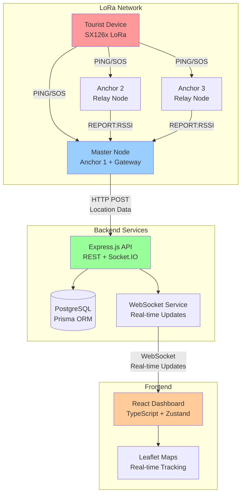

# Design Document

## Overview

The Tourist Safety System Integration project will complete the end-to-end integration of three existing components: a LoRa IoT positioning system, a Node.js backend API, and a React dashboard. The integration will establish seamless real-time data flow from LoRa devices through the backend to dashboard updates, enabling comprehensive tourist tracking and emergency response capabilities.

The system architecture follows a hub-and-spoke pattern where the LoRa master node acts as a gateway, collecting positioning data from tourist devices and forwarding it to the centralized backend. The backend serves as the data hub, processing location updates, managing device registrations, and broadcasting real-time updates to connected dashboard clients via WebSocket connections.

Key integration points include: HTTP API communication between LoRa master node and backend, coordinate system conversion from local trilateration to GPS coordinates, real-time WebSocket updates from backend to dashboard, and comprehensive error handling with offline data caching and retry mechanisms.

## Architecture

### System Components



### Data Flow Architecture

The system implements a three-tier data flow:

1. **Data Collection Tier**: LoRa tourist devices broadcast position pings every 2 seconds. Three anchor nodes (master + 2 relays) measure RSSI values and report to the master node.

2. **Processing Tier**: Master node performs trilateration calculations, converts local coordinates to GPS, and sends structured data to the backend via HTTP POST. Backend validates device registration, stores location history, and broadcasts real-time updates.

3. **Presentation Tier**: Dashboard receives WebSocket updates and renders real-time tourist positions on interactive maps with emergency alert notifications.

### Integration Patterns

**Request-Response Pattern**: LoRa master node to backend API for location updates and device registration validation.

**Publish-Subscribe Pattern**: Backend to dashboard clients for real-time location updates and SOS alerts via WebSocket connections.

**Circuit Breaker Pattern**: Master node implements retry logic with exponential backoff when backend is unreachable, with local data caching.

**Event-Driven Pattern**: SOS alerts trigger immediate notifications across all connected dashboard clients with high-priority routing.

## Components and Interfaces

### LoRa System Components

**Master Node (Gateway)**
- **Purpose**: Primary anchor node that performs trilateration and communicates with backend
- **Location**: `tourist-safety-system/src/nodes/master.py`
- **Key Functions**:
  - Collect RSSI readings from tourist devices and relay anchors
  - Perform trilateration calculations using MathEngine
  - Convert local X,Y coordinates to GPS lat/lng
  - Send HTTP POST requests to backend API
  - Implement retry logic and offline data caching
- **Dependencies**: BackendClient, MathEngine, SX126x driver
- **Configuration**: Anchor positions, GPS reference point, backend URL

**Backend Client Module**
- **Purpose**: HTTP client for communicating with backend API
- **Location**: `tourist-safety-system/src/utils/backend_client.py` (to be created)
- **Key Functions**:
  - Send location updates with device ID, coordinates, RSSI, SOS flag
  - Implement retry logic with exponential backoff
  - Handle coordinate conversion from local to GPS
  - Validate API responses and handle errors
- **Interface**:
  ```python
  class BackendClient:
      def send_location(device_id: str, x: float, y: float, rssi_avg: int, sos_flag: bool) -> bool
      def check_connection() -> bool
      def send_heartbeat(anchor_id: str, stats: dict) -> bool
  ```

**Math Engine**
- **Purpose**: Trilateration calculations and coordinate conversions
- **Location**: `tourist-safety-system/src/utils/math_helper.py` (existing)
- **Key Functions**:
  - Convert RSSI to distance using path loss model
  - Perform trilateration with three anchor points
  - Handle coordinate system transformations
- **Interface**:
  ```python
  class MathEngine:
      @staticmethod
      def rssi_to_distance(rssi: int) -> float
      @staticmethod
      def trilaterate(anchors_data: List[dict]) -> Tuple[float, float]
  ```

### Backend API Components

**Location Controller**
- **Purpose**: Handle location updates from LoRa gateway
- **Location**: `tourist-safety-system/src/controllers/locationController.js` (existing)
- **Key Endpoints**:
  - `POST /api/location/update` - Receive location data from master node
  - `GET /api/location/active` - Get all active tourist locations
  - `GET /api/location/:touristId/history` - Get location history
- **Functions**:
  - Validate device registration before storing location
  - Create SOS alerts when sos_flag is true
  - Broadcast real-time updates via Socket.IO
  - Update tourist status and last_seen timestamp

**Tourist Controller**
- **Purpose**: Manage tourist registration and device association
- **Location**: `tourist-safety-system/src/controllers/touristController.js` (existing)
- **Key Endpoints**:
  - `POST /api/tourist/register` - Register new tourist with device ID
  - `GET /api/tourists` - List all registered tourists
  - `PATCH /api/tourist/:id/status` - Update tourist status
- **Functions**:
  - Ensure unique device IDs across active tourists
  - Validate tourist registration data
  - Handle trip start/end lifecycle

**Socket Service**
- **Purpose**: Real-time WebSocket communication with dashboard clients
- **Location**: `tourist-safety-system/src/utils/socketService.js` (existing)
- **Key Events**:
  - `location_update` - Broadcast tourist position updates
  - `sos_alert` - Broadcast emergency alerts
  - `tourist_offline` - Notify when tourist goes offline
- **Functions**:
  - Manage WebSocket connections and rooms
  - Handle client authentication and authorization
  - Implement connection heartbeat and reconnection

### Dashboard Components

**Store Management**
- **Purpose**: Centralized state management using Zustand
- **Location**: `tourist-safety-dashboard/src/store/store.ts` (existing)
- **Key State**:
  - Tourist locations and status
  - Active alerts and emergencies
  - System health and metrics
  - WebSocket connection status
- **Functions**:
  - Handle real-time updates from WebSocket
  - Manage optimistic updates for user actions
  - Implement data refresh and error recovery

**API Client**
- **Purpose**: HTTP client for backend communication
- **Location**: `tourist-safety-dashboard/src/api/api.ts` (existing)
- **Key Functions**:
  - Authenticate requests with JWT tokens
  - Handle API responses and error states
  - Implement request/response interceptors
  - Support both real API and mock data modes

**Map Component**
- **Purpose**: Real-time tourist tracking visualization
- **Location**: `tourist-safety-dashboard/src/components/Map/` (existing)
- **Key Features**:
  - Display tourist positions with unique markers
  - Show anchor node locations and coverage areas
  - Render SOS alerts with prominent visual indicators
  - Support map layers for zones and geofences
- **Dependencies**: Leaflet, React-Leaflet

## Data Models

### LoRa Message Formats

**Tourist Ping Message**
```
Format: "PING:DEVICE_ID" or "SOS:DEVICE_ID"
Examples: 
  - "PING:DEV001" (normal position update)
  - "SOS:DEV001" (emergency alert)
```

**Relay Report Message**
```
Format: "REPORT:ANCHOR_ID:RSSI_VALUE"
Examples:
  - "REPORT:ANCHOR_2:-65"
  - "REPORT:ANCHOR_3:-72"
```

### Backend API Data Models

**Location Update Request**
```json
{
  "device_id": "DEV001",
  "x": 45.67,
  "y": 23.45,
  "lat": 11.0168,
  "lng": 76.9558,
  "rssi": -65,
  "sos_flag": false
}
```

**Tourist Registration**
```json
{
  "name": "John Doe",
  "phone": "9876543210",
  "device_id": "DEV001",
  "emergency_contact": "9876543211",
  "emergency_contact_name": "Jane Doe",
  "nationality": "Indian",
  "group_size": 2
}
```

**SOS Alert**
```json
{
  "id": "uuid",
  "tourist_id": "uuid",
  "device_id": "DEV001",
  "location": {
    "lat": 11.0168,
    "lng": 76.9558,
    "x": 45.67,
    "y": 23.45
  },
  "status": "active",
  "created_at": "2024-01-09T10:30:00Z"
}
```

### Database Schema Extensions

**LocationLog Table** (existing, no changes needed)
```sql
CREATE TABLE LocationLog (
  id UUID PRIMARY KEY,
  device_id VARCHAR(50) NOT NULL,
  tourist_id UUID REFERENCES Tourist(id),
  x FLOAT NOT NULL,
  y FLOAT NOT NULL,
  lat FLOAT,
  lng FLOAT,
  rssi FLOAT,
  is_sos BOOLEAN DEFAULT FALSE,
  timestamp TIMESTAMP DEFAULT NOW()
);
```

**Anchor Table** (existing, may need GPS coordinates)
```sql
CREATE TABLE Anchor (
  id UUID PRIMARY KEY,
  anchor_id VARCHAR(50) UNIQUE NOT NULL,
  name VARCHAR(100) NOT NULL,
  local_position JSON NOT NULL, -- {x: float, y: float}
  gps_position JSON,            -- {lat: float, lng: float}
  is_master BOOLEAN DEFAULT FALSE,
  status VARCHAR(20) DEFAULT 'offline',
  last_heartbeat TIMESTAMP,
  hardware JSON,
  stats JSON
);
```

### WebSocket Event Schemas

**Location Update Event**
```json
{
  "event": "location_update",
  "data": {
    "tourist_id": "uuid",
    "name": "John Doe",
    "x": 45.67,
    "y": 23.45,
    "lat": 11.0168,
    "lng": 76.9558,
    "rssi": -65,
    "status": "active",
    "sos": false,
    "timestamp": "2024-01-09T10:30:00Z"
  }
}
```

**SOS Alert Event**
```json
{
  "event": "sos_alert",
  "data": {
    "sos_id": "uuid",
    "tourist_id": "uuid",
    "tourist_name": "John Doe",
    "phone": "9876543210",
    "emergency_contact": "9876543211",
    "location": {
      "lat": 11.0168,
      "lng": 76.9558,
      "x": 45.67,
      "y": 23.45
    },
    "timestamp": "2024-01-09T10:30:00Z"
  }
}
```

## Correctness Properties

*A property is a characteristic or behavior that should hold true across all valid executions of a system-essentially, a formal statement about what the system should do. Properties serve as the bridge between human-readable specifications and machine-verifiable correctness guarantees.*

### Property 1: Location Data Flow Integrity
*For any* tourist device broadcasting a position ping, the complete data flow from LoRa trilateration through backend storage to dashboard display should preserve location accuracy and include all required metadata (device ID, coordinates, RSSI, timestamp).
**Validates: Requirements 1.1, 1.2, 1.4**

### Property 2: Device Registration Validation
*For any* device attempting to send location data, the backend should only accept and store data from devices that are properly registered with unique device IDs, rejecting unregistered devices and logging the attempts.
**Validates: Requirements 3.1, 3.2, 3.3**

### Property 3: SOS Alert End-to-End Workflow
*For any* SOS alert triggered by a tourist device, the complete workflow from device broadcast through backend processing to dashboard notification should execute immediately with high priority, creating emergency records and notifying all connected clients.
**Validates: Requirements 2.1, 2.2, 2.3, 2.4, 2.5**

### Property 4: Coordinate System Conversion Accuracy
*For any* trilateration result, the conversion from local X,Y coordinates to GPS latitude/longitude should use consistent calibrated reference points, apply correct orientation and scale factors, and produce coordinates within valid geographic bounds.
**Validates: Requirements 4.1, 4.2, 4.3, 4.4, 4.5**

### Property 5: Real-Time Dashboard Updates
*For any* location update or system event, the dashboard should receive and display the update in real-time via WebSocket connection without requiring page refresh, maintaining accurate visual representation of tourist positions and system status.
**Validates: Requirements 5.1, 5.2, 5.3, 5.4, 5.5**

### Property 6: Multi-Device Concurrent Processing
*For any* number of active tourist devices, the LoRa system should handle concurrent position calculations while maintaining separate tracking state for each device, and the dashboard should display distinct markers with unique identifiers for each tourist.
**Validates: Requirements 6.1, 6.2, 6.4**

### Property 7: Tourist Offline Detection
*For any* tourist device that stops broadcasting for 5 minutes, the backend should automatically mark the tourist as potentially missing and alert responders while preserving the last known position.
**Validates: Requirements 6.5**

### Property 8: System Health Monitoring
*For any* system component (LoRa network, backend services, database), health status should be continuously monitored and reported to administrators, with status indicators displayed on the dashboard reflecting current system state.
**Validates: Requirements 7.1, 7.2, 7.3**

### Property 9: Network Resilience and Recovery
*For any* network connectivity failure, the master node should cache location data locally and implement retry logic with exponential backoff, synchronizing cached data when connectivity is restored.
**Validates: Requirements 1.5, 7.4, 10.1**

### Property 10: Data Persistence and History
*For any* location data received, the backend should store complete location history with timestamps and provide efficient access to historical data for analysis and reporting.
**Validates: Requirements 8.1, 8.3, 8.4**

### Property 11: Authentication and Authorization
*For any* access attempt to the dashboard or API, the system should enforce authentication with JWT tokens, validate user permissions for requested operations, and handle session expiration by redirecting to login and clearing sensitive data.
**Validates: Requirements 9.1, 9.2, 9.3, 9.4, 9.5**

### Property 12: Error Isolation and Graceful Degradation
*For any* parsing error in LoRa messages or database unavailability, the system should log the error, continue processing other operations where possible, and implement graceful degradation to maintain service availability.
**Validates: Requirements 10.2, 10.3, 10.5**

### Property 13: WebSocket Connection Resilience
*For any* WebSocket connection interruption, the dashboard should automatically detect the disconnection and attempt reconnection with exponential backoff while displaying connection status to users.
**Validates: Requirements 10.4**

### Property 14: Bulk Data Processing Efficiency
*For any* volume of concurrent location updates from multiple devices, the backend should efficiently process and store all updates while maintaining data integrity and broadcasting real-time updates to connected clients.
**Validates: Requirements 6.3**

### Property 15: Data Retention and Lifecycle Management
*For any* tourist trip completion, the system should allow device deactivation while preserving historical data and implementing data retention policies to manage storage growth over time.
**Validates: Requirements 3.4, 8.2**

## Error Handling

### LoRa System Error Handling

**Network Communication Failures**
- Master node implements local data caching when backend is unreachable
- Retry logic with exponential backoff (1s, 2s, 4s delays) for up to 3 attempts
- Cached data synchronization when connectivity is restored
- Heartbeat mechanism to detect and report connectivity status

**Message Parsing Errors**
- Invalid message formats are logged and discarded
- Processing continues for other valid messages
- Error statistics are tracked and reported to backend
- Malformed RSSI values are handled with default distance calculations

**Hardware Failures**
- LoRa module initialization errors are logged and retried
- GPIO cleanup on shutdown to prevent hardware conflicts
- Graceful degradation when running in simulation mode
- Hardware status monitoring and reporting

### Backend API Error Handling

**Database Connection Failures**
- Connection pooling with automatic retry mechanisms
- Graceful degradation with in-memory caching for critical operations
- Database health checks and monitoring
- Transaction rollback on partial failures

**Invalid Request Handling**
- Input validation with detailed error messages
- Device ID validation against registered tourists
- Geographic bounds checking for coordinates
- Rate limiting to prevent abuse and overload

**WebSocket Connection Management**
- Automatic client reconnection handling
- Connection heartbeat and timeout detection
- Room-based message broadcasting with error recovery
- Client authentication and authorization validation

### Dashboard Error Handling

**API Communication Failures**
- Automatic retry with exponential backoff for failed requests
- Fallback to cached data when API is unavailable
- User-friendly error messages and recovery suggestions
- Optimistic updates with rollback on failure

**WebSocket Disconnection Recovery**
- Automatic reconnection attempts with status indicators
- Buffering of missed updates during disconnection
- Connection state management and user notification
- Graceful degradation to polling mode if WebSocket fails

**Data Validation and Display**
- Input validation for user actions and form submissions
- Error boundaries to prevent application crashes
- Loading states and progress indicators for async operations
- Fallback UI components for missing or invalid data

## Testing Strategy

### Dual Testing Approach

The testing strategy employs both unit testing and property-based testing to ensure comprehensive coverage:

**Unit Tests** focus on:
- Specific examples and edge cases
- Integration points between components
- Error conditions and boundary values
- Mock data scenarios and API responses

**Property Tests** focus on:
- Universal properties that hold for all inputs
- Comprehensive input coverage through randomization
- System behavior under various conditions
- End-to-end workflow validation

### Property-Based Testing Configuration

**Testing Framework**: Fast-check for JavaScript/TypeScript components, Hypothesis for Python components

**Test Configuration**:
- Minimum 100 iterations per property test
- Each property test references its design document property
- Tag format: **Feature: tourist-safety-integration, Property {number}: {property_text}**

**Property Test Examples**:

```javascript
// Property 1: Location Data Flow Integrity
test('Location data flow preserves accuracy and metadata', async () => {
  await fc.assert(fc.asyncProperty(
    fc.record({
      device_id: fc.string({ minLength: 1, maxLength: 20 }),
      x: fc.float({ min: -1000, max: 1000 }),
      y: fc.float({ min: -1000, max: 1000 }),
      rssi: fc.integer({ min: -120, max: -10 })
    }),
    async (locationData) => {
      // Test complete data flow from LoRa to dashboard
      const result = await processLocationUpdate(locationData);
      expect(result.device_id).toBe(locationData.device_id);
      expect(result.coordinates).toBeDefined();
      expect(result.timestamp).toBeDefined();
    }
  ), { numRuns: 100 });
});
```

```python
# Property 4: Coordinate System Conversion Accuracy
@given(x=floats(min_value=-1000, max_value=1000),
       y=floats(min_value=-1000, max_value=1000))
def test_coordinate_conversion_accuracy(x, y):
    """Feature: tourist-safety-integration, Property 4: Coordinate conversion accuracy"""
    lat, lng = convert_to_gps(x, y)
    
    # Verify coordinates are within valid geographic bounds
    assert -90 <= lat <= 90
    assert -180 <= lng <= 180
    
    # Verify conversion is consistent
    lat2, lng2 = convert_to_gps(x, y)
    assert lat == lat2 and lng == lng2
```

### Unit Testing Strategy

**LoRa System Tests**:
- Trilateration algorithm accuracy with known anchor positions
- RSSI to distance conversion with calibrated values
- Message parsing and format validation
- Backend client retry logic and error handling

**Backend API Tests**:
- Location controller endpoint validation
- Tourist registration and device ID uniqueness
- WebSocket event broadcasting and client management
- Database operations and transaction handling

**Dashboard Tests**:
- Component rendering with various data states
- API client request/response handling
- Store state management and updates
- Map component integration and marker display

### Integration Testing

**End-to-End Workflow Tests**:
- Complete tourist tracking from device to dashboard
- SOS alert propagation and emergency response
- Multi-device concurrent tracking scenarios
- System recovery after network outages

**Performance Testing**:
- Load testing with multiple concurrent devices
- WebSocket connection scalability
- Database query performance under load
- Memory usage and resource optimization

### Test Data Management

**Mock Data Generation**:
- Realistic tourist movement patterns
- Various device configurations and scenarios
- Network failure and recovery simulations
- Authentication and authorization test cases

**Test Environment Setup**:
- Isolated test database with seed data
- Mock LoRa hardware simulation
- WebSocket testing utilities
- Automated test data cleanup